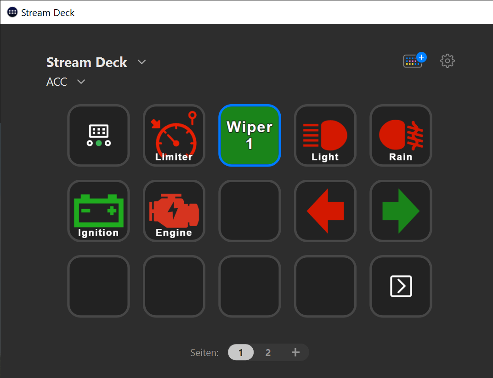

= Stream Deck SimHub Plugin
:toc:

== About

This is a plugin for https://www.elgato.com/stream-deck[Stream Deck]. It offers Stream Deck actions, which are updating their state from https://www.simhubdash.com/[SimHub].

This means, that actions can be bound to SimHub properties. If the value of a bound SimHub property changes, the button in Stream Deck will reflect this property change.

This plugin depends on the https://github.com/pre-martin/SimHubPropertyServer[SimHub Property Server plugin], which has to be installed in SimHub.

In the screenshot below, icons are green because they are "on" in the simulation or in SimHub.

== Installation

Be sure to have the SimHub Property Server plugin installed into SimHub (see above). When updating this plugin, be sure to also check the SimHub Property Server plugin for updates.

Download the file `net.planetrenner.simhub.streamDeckPlugin` from the GitHub "Releases" page and double-click it to install it into Stream Deck.

== Usage

See link:doc/Usage.adoc[Usage.adoc]
