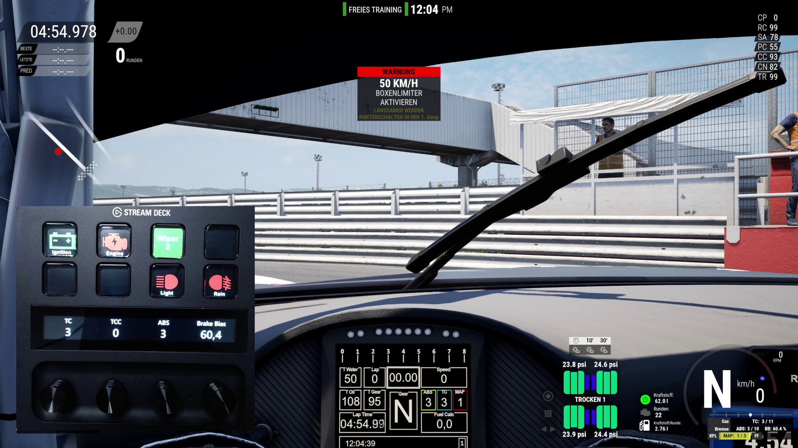
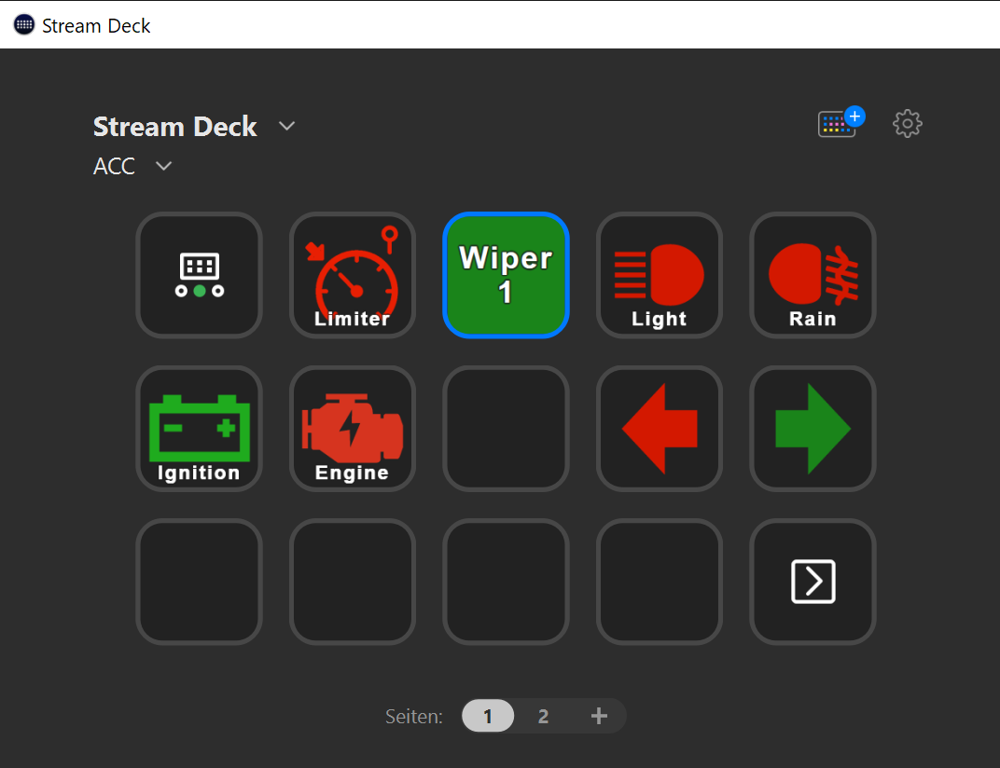

= Stream Deck SimHub Plugin
:toc:
:sectnums:
ifdef::env-github[]
:tip-caption: :bulb:
:warning-caption: :warning:
endif::[]
ifndef::env-github[]
:tip-caption: 💡
:warning-caption: ⚠️
endif::[]

TIP: Always read the *correct version* of the documentation, which matches the version of the plugin that you have installed. To do so, use the dropdown in the top left, which usually contains the value "main". Select the "tag" that matches your installed version.

== About

This is a plugin for https://www.elgato.com/stream-deck[Stream Deck]. It offers Stream Deck actions, which are updating their state from https://www.simhubdash.com/[SimHub].

This means, that actions can be bound to SimHub properties. If the value of a bound SimHub property changes, the button in Stream Deck will reflect this property change.

This plugin depends on the https://github.com/pre-martin/SimHubPropertyServer[SimHub Property Server plugin], which has to be installed in SimHub.

This *video* shows some of the features:

ifdef::env-github[]
[.text-center]
 +
https://youtu.be/st_pZHmmHxY[Watch on YouTube]
endif::[]

ifndef::env-github[]
[.text-center]
video::st_pZHmmHxY[youtube,800,450]
endif::[]

In the screenshot below, icons are green because they are "on" in the simulation or in SimHub.

[.text-center]

In this screenshot, TC, TCC and ABS are mapped to Stream Deck buttons. The current values are also displayed, as well as Brake Bias.

[.text-center]
image::images/teaser/Teaser-2.png[Teaser 2,800]

== Installation

WARNING: To download, do not use the green button! Instead, click on "Releases" on the right side and download the file with extension `streamDeckPlugin`.

Be sure to have the SimHub Property Server plugin installed into SimHub (see above). When updating this plugin, be sure to also check the SimHub Property Server plugin for updates.

TIP: For the usage of this plugin, the https://dotnet.microsoft.com/en-us/download/dotnet/8.0[.NET Runtime 8.0] has to be installed. Without this, the plugin won't even start. Download ".NET Desktop Runtime 8.0.x (x64)" from Microsoft.

Download the file `net.planetrenner.simhub.streamDeckPlugin` from the GitHub "Releases" page and double-click it to install it into Stream Deck.

== Usage

See documents in folder link:doc/README.adoc["doc"]
