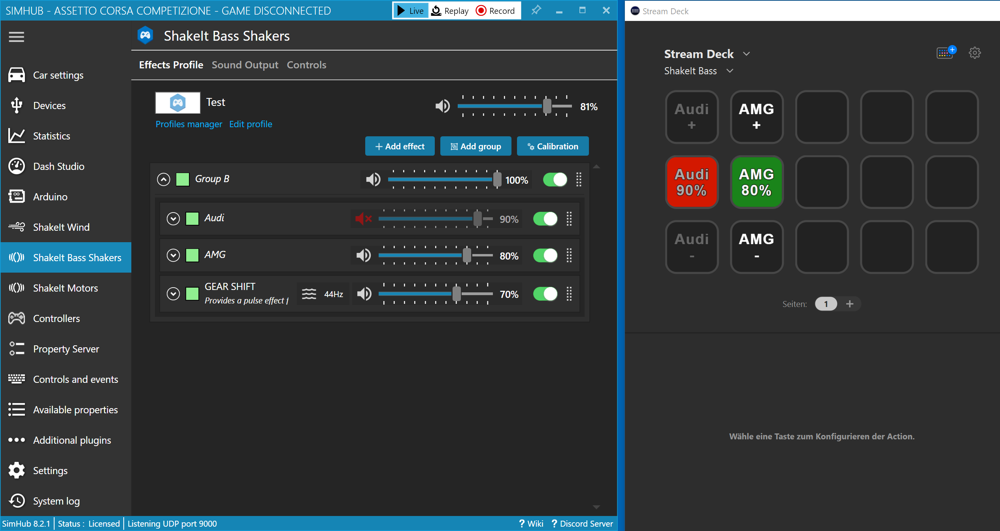
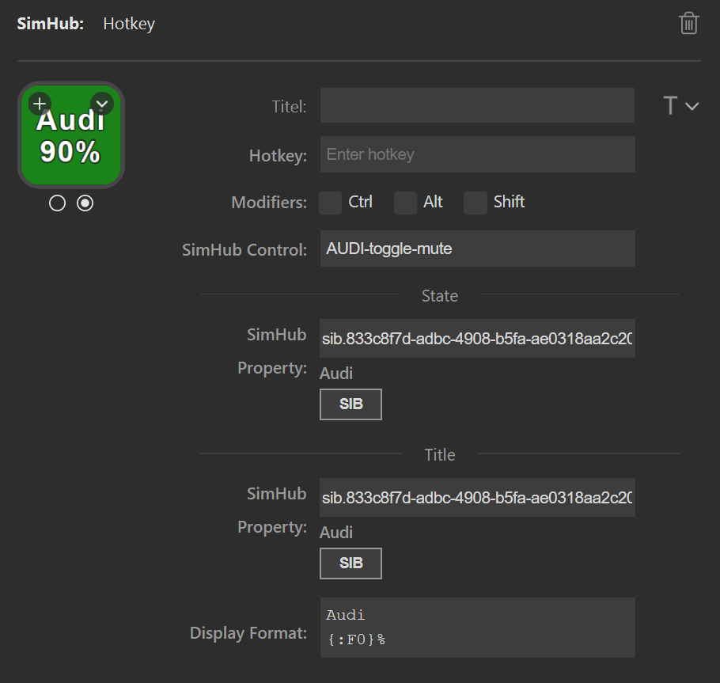
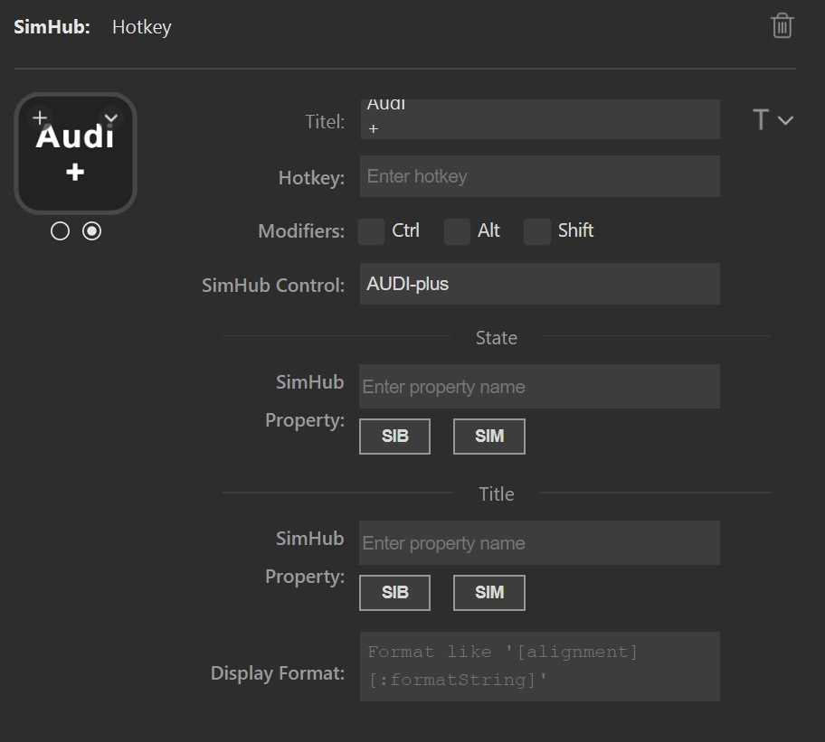
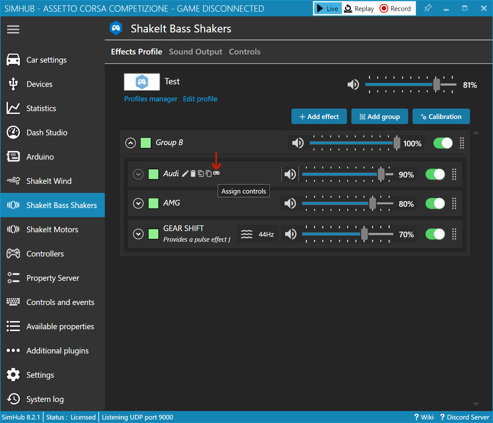
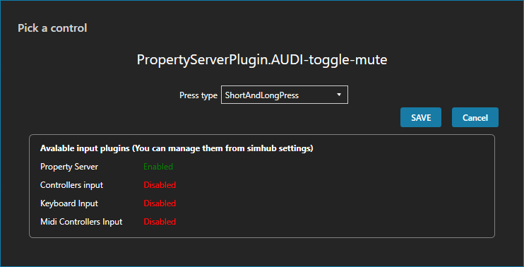

= ShakeIt Features
:toc:
:sectnums:
ifdef::env-github[]
:tip-caption: :bulb:
endif::[]
ifndef::env-github[]
:tip-caption: 💡
endif::[]

TIP: Always read the *correct version* of the documentation, which matches the version of the plugin that you have installed. To do so, use the dropdown in the top left, which usually contains the value "main". Select the "tag" that matches your installed version.

== Button SIB

This button allows easy access to ShakeIt Bass properties from SimHub. It requires that SimHub is running on the same PC, because ShakeIt profiles are read online from SimHub.

After clicking on this button, a new window opens, that displays all ShakeIt Bass profiles, their effect groups and effects: The ShakeIt browser. Each effect group and each effect have a "plus" icon on the far right: When clicked, a menu opens where you can select the "Gain" property or the "IsMuted" property of this element.

After selecting one of these two properties, the ShakeIt browser closes and inserts the correct technical property name into the input field. In the same time, a new label appears below the input field: It displays the name of the effect group or effect as it is defined in SimHub.

This label is only updated after selecting a property from the ShakeIt browser. If you either rename the element in SimHub or copy&paste the property name from one input field to another one, the label is not updated. In this case, simply open the ShakeIt browser again by pressing the "SIB" button, the current element is already preselected, and select its "Gain" or "IsMuted" property again. This causes the label to be updated.

After selecting a property in the ShakeIt browser, only the property name will be replaced in the input field. If you have a condition in the input field (like `sib.abcd-efgh.IsMuted==false`), **only the property name will replaced**, the condition will stay intact.

== Unique GUIDs are IMPORTANT!

ShakeIt properties are accessed through an unique id (called "GUID"), which is managed by SimHub. Unfortunately, SimHub does not enforce that these Guids are really unique. So it can happen, that you are affected by problems caused by duplicate Guids: **You address one effect, but actually get the value of another effect.**

You have to repair these duplicated Guids. If you are responsible for a profile, you should repair the profile before distributing it. If you import a profile from another maintainer, you can test the profile. If it has duplicate Guids, you should inform the maintainer and ask him to repair the profile.

As this repair functionality it part of the SimHub Property Server, please head over to the documentation of that plugin: https://github.com/pre-martin/SimHubPropertyServer#how-to-repair-shakeit-profiles

== Example

In this example, we have two effect groups ("Audi" and "AMG"). We want to control the muted state and the gain value of these two groups, as well as display the current values:

=== Center button for mute/unmute

We start with the "Audi" button in the center, which shows the current gain value and the "muted" state: green is unmuted, red is muted. We drag a "Hotkey" action to an empty slot and replace the icons with a solid red and a solid green icon (or whatever you like). We make the following adjustments:

In order to be able to toggle the muted state with this button:

. "SimHub Control": Enter `AUDI-toggle-mute`

To display the muted state with the red or green icon:

. "SimHub Property (state)":
.. Open the ShakeIt browser by clicking on the button "SIB"
.. Navigate to the effect group ("Audi" in my case)
.. Click on the "+" icon and select "IsMuted"
. The label just between the button and the input field should now contain the hint "Audi" (or whatever name your group has)
. The state is now inverted: red for unmuted and green for muted. To fix that:
.. Go into the field "SimHub Property (state)". It contains the value `sib.a-long-guid.IsMuted`
.. Scroll all the way to the right (e.g. press "End" on your keyboard)
.. After `IsMuted` append the string `==false`
.. Your input field should now contain `sib.a-long-guid.IsMuted==false` and your button should immediately toggle its state

To display the current gain on the button:

. "SimHub Property (title)":
.. Open again the ShakeIt browser, select again the effect group, but this time select "Gain" instead of "IsMuted"
. Again, the label just between the button and the input field should contain the hint "Audi"
. Also, the button should already display the gain value. Maybe with way too much decimal places
. Enter `Audi {:F0}%` into the field "Display Format". Press enter or return on your keyboard right after the word `Audi`
. The text on the button is now very small
.. Scroll up to the Stream Deck field "Title" (the topmost field - in my screenshot it is labeled "Titel" because it is on a German PC). In the dropdown on the right, adjust the size and the alignment.
.. Toggle the button state on the left to the other state with the radiobutton below the button.
.. Adjust the size and alignment of the title again for this state.

Your button should now look like this:

=== Buttons for "+" and "-"

These buttons are much easier.

Again we drag a "Hotkey" action to the slot just above the "mute/unmute" button. We replace both icons with a transparent icon (or whatever color you like). The adjustments are as follows:

. Enter `Audi +` in the Stream Deck field "Title". You can press enter or return right after the word `Audi`
. In the dropdown on the right, adjust the size and the alignment
. Toggle the button state on the left to the other state
. Adjust the title, size and alignment again for this state
. "SimHub Control": Enter "AUDI-plus"

Repeat these steps for the "-" button. For "SimHub Control" enter "AUDI-minus".

The "+" buttons likes like this:

=== Assign controls in SimHub

. Open the effect group "Audi" in SimHub.
. Open the dialog to assign controls:
+

. Click to configure "Mute toggle control"
. Press the center button on your Stream Deck
. Your result should look as follows:
+

. Repeat the assignment for "Increment gain" and "Decrement gain"

=== Bonus: Toggle whole Stream Deck column

In the very first screenshot, you can see that my three "Audi" buttons are greyed out, because the effect group is muted. This can be achieved as follows:

. Bind the "Audi" property "IsMuted" to the "+" and "-" button ("SimHub Property (state)"). Append `==false` as for the mute button in the center
. Activate the "muted" state of each of the three buttons
. From the dropdown menu of the Stream Deck field "Title", select a gray color.
