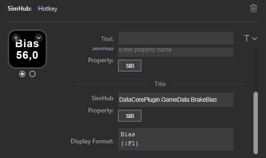
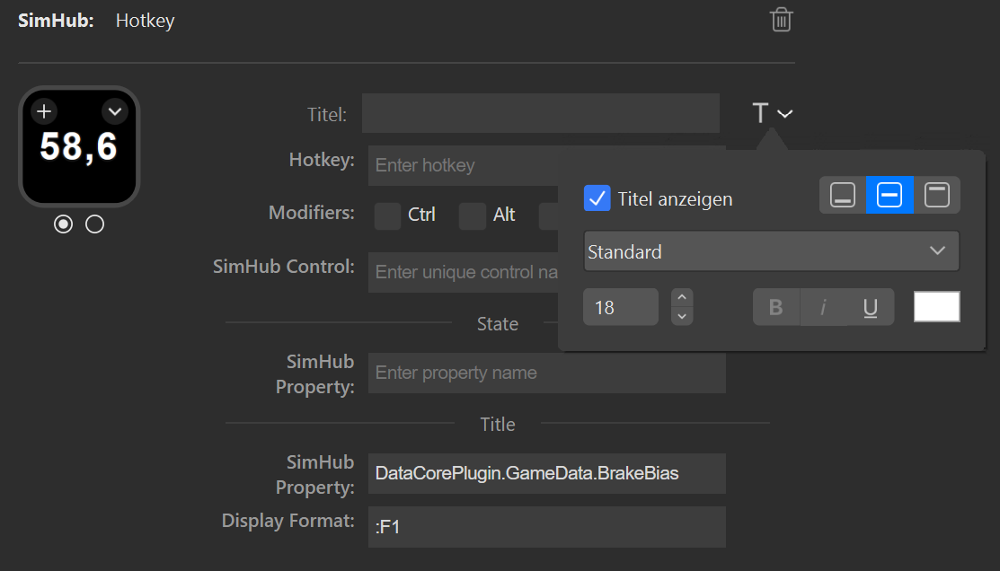

= Usage of the plugin
:toc:
:sectnums:
ifdef::env-github[]
:tip-caption: :bulb:
endif::[]
ifndef::env-github[]
:tip-caption: 💡
endif::[]

TIP: Always read the *correct version* of the documentation, which matches the version of the plugin that you have installed. To do so, use the dropdown in the top left, which usually contains the value "main". Select the "tag" that matches your installed version.

== Overview

After the installation of the Plugin, a new category named "SimHub" will be available in Stream Deck. Use the actions of this category to get Stream Deck buttons, which will interact with SimHub, e.g. update their state from SimHub properties.

[#hotkey]
== Action "Hotkey"

=== Description

This action offers the same functionality as the built-in action "Hotkey", but with some additional SimHub related features. The features are as follows:

- Send a keystroke event to the active window (like the built-in "Hotkey")
- Send an input trigger to SimHub
- Bind the state of the button ("on" or "off") to the real state of a SimHub property

This allows to interact with the simulation (by sending keystroke events to the simulation), to interact with SimHub (by sending input triggers to SimHub) and to visualize the correct state of properties, no matter if these properties have been modified by the button or some other means: The button will always display the correct state.

The fields of this action are as follows:

* *Hotkey* +
  This optional field takes a key, which should be sent to the active window. +
  Please see the structure link:/StreamDeckSimHub.Plugin/Tools/Keyboard.cs[VirtualKeyShort] for supported key names. For alphanumeric keys (0-1, A-Z) the prefix `KEY_` can be omitted, so either `KEY_P` and `P` will have the same result. +
  Some examples of valid values for the field "Hotkey" are:
  ** `A` (will send the event for the key "A" to the active window)
  ** `KEY_A` (same as above)
  ** `SPACE` (will send an event for the space key)
  ** `F11` (event for F11)

+
Please note, that not all entries in "VirtualKeyShort" make sense in the field "Hotkey".

* *Modifiers* +
  Modifiers like Ctrl, Alt and Shift have to be specified by using the corresponding checkbox.
* *SimHub Control* +
  This optional field may take a *unique* string. This string will be sent as an input trigger to SimHub, where it is used to identify this Stream Deck button. See the section <<#input>> below for details about input triggers.
* *SimHub Property (for state)* +
  This optional field allows to enter the name of a SimHub property or even a logical expression with a SimHub property. The SimHub property or the result of the logical expression will be used to set the state of the button to either "on" or "off". See the section <<#simHubPropertyForState>> for details.
* *SimHub Property (for title)* +
  This optional field allows to specify a SimHub property, which will be displayed as the "Title" of the button. Be sure to leave the default Stream Deck field "Title" empty. However you can use all available formatting options of the default field "Title", like alignment, size, color etc.
* *Display Format (for title)* +
  Another optional field. If set, the SimHub property for the title will be formatted with this format string. If this field is empty, a default format is used. See the section <<#displayFormatForTitle>> for details.

[#simHubPropertyForState]
=== Field "SimHub Property (for state)"

This field allows to bind the button to a SimHub property, which will be used to determine the state of the button.

All properties, that are listed in SimHub under "Available properties" (around 2000+ properties) can be used. But the plugin allows access to even more properties, and for use in these Stream Deck actions, it is better to use "_typed_" properties instead of "_generic_" properties.

TIP: Be sure to read the documentation of the https://github.com/pre-martin/SimHubPropertyServer[SimHub Property Server plugin], especially the section about the available properties!

TIP: "Generic" properties are received untyped as `object` (see SimHubPropertyServer plugin). This plugin tries to interpret them as a `double` value. If this is not possible, they are treated as strings.

==== Simple SimHub Property

Enter the name of a SimHub property. E.g.

----
dcp.gd.EngineIgnitionOn
----

The value of this SimHub property will update the state of the button.

The logic for the action state depending on the SimHub property value is as follows:

* Properties of type `boolean`: +
  If the property value is `True`, the action will be in the "on" state, otherwise in the "off" state.
* Properties of type `integer`, `long`, `float` or `double`: +
  If the property value is greater than zero, the action will be in the "on" state, otherwise in the "off" state.

==== SimHub property with logical expression

This allows a much finer grained logic for the button state. Enter the name of a SimHub property, a condition and a value. E.g.

----
acc.graphics.gapBehind>=-500
----

In this example, the button would be in the state "on", if the gap behind is equal to or smaller than 500 milliseconds. It would be "off", if the gap behind is greater than 500 milliseconds. The field "Hotkey" could be empty in this example, so that the Stream Deck button could be used as an indicator only.

The following conditions are supported:

- `==` test for equal
- `>=`
- `>`
- `+<=+`
- `<`
- `!=` test for not equal
- `~~` test for "between two values", which means ">= value1 and +<=+ value2"

The condition "between" requires two values, which have to be separated by a semicolon, e.g.

----
acc.graphics.WiperLV~~1;2
----

The following table shows the comparison logic for different SimHub property types and comparison values (which are entered into the field "SimHub Property"):

|===
| SimHub property type | supported comparison values | evaluation rules

| boolean
| "true", "false"
| should be self explanatory

|
| any integer value
| comp. value == 0: "false" +
comp. value > 0: "true"

| integer
| any integer value
| should be self explanatory

|
| "true", "false"
| prop. value == 1: "true" +
all other prop. values: "false"

| long
| same as "integer"
| same as integer

| double
| any integer or floating
| should be self explanatory

| object
| anything
| The types of the property value and the comparision value have to be the same, otherwise they are treated as "not equal". The plugin tries to interpret property values of type "object" as "double". If this is possible, the comparison value should be also of type "double", otherwise they are "not equal".

|===

So the following expressions are all valid:

* SimHub property of type "boolean": +
  `dcp.gd.IsLapValid==true` or `dcp.gd.IsLapValid==1` or just `dcp.gd.IsLapValid`
* SimHub property of type "integer": +
  `dcp.gd.SpotterCarLeft>0` or `dcp.gd.SpotterCarLeft==true` or just `dcp.gd.SpotterCarLeft`
* Another "integer": +
  `acc.physics.Gear~2;4`
* Generic SimHub property: +
  `DataCorePlugin.GameData.SpotterCarLeft>0` or just `DataCorePlugin.GameData.SpotterCarLeft`

[#displayFormatForTitle]
=== Field "Display Format (for title)"

If this field is empty, the value of the SimHub property for the title will be displayed with the default formatter of that type. If this is not desired, a more extensive format can be specified here.

Two options are available: A "*simple format*" and a "*full format*". The main difference is, that the "simple format" only allows an alignment and a format string, whereas the "full format" allows a combination of static text plus the features of the "simple format".

==== Simple Format

The display format has this syntax:

----
[alignment][:formatString]
----

If the format is invalid, the default formatter of the type is used as a fallback.

`alignment` is optional. It is a signed integer that indicates the total length of the title and whether it is right-aligned (a positive integer) or left-aligned (a negative integer)

`:formatString` is optional. It has to start with `:` (colon) and it has to be a valid C# format string.

Technically, the above syntax is the inner part of a C# format string. For details see:

* https://learn.microsoft.com/en-us/dotnet/api/system.string.format?view=net-6.0#the-format-item
* https://learn.microsoft.com/en-us/dotnet/standard/base-types/standard-numeric-format-strings
* https://learn.microsoft.com/en-us/dotnet/standard/base-types/custom-numeric-format-strings

Here are a few examples for the "Display Format" that should already cover a large number of cases. `_` is used in these examples to indicate a space in the generated output:

Only alignment::

* Display format `-3` will display the value left-aligned with a length of 3 digits:
** Property value `1` is displayed as `1__`
** Property value `34` is displayed as `34_`
** Property value `250` is displayed as `250`
* Display format `3` will display the value right-aligned with a length if 3 digits:
** Property value `1` is displayed as `__1`
** Property value `34` is displayed as `_34`
** Property value `250` is displayed as `250`

Only formatString::

* Display format `:F0` will display the value as a fixed-point value without decimal digits:
** `34.3333333` will be displayed as `34`
** `34.55` will be displayed as `35`
* Display format `:F1` will display the value as a fixed-point value with 1 decimal digit:
** `34.3333333` will be displayed as `34.3`
** `34.55` will be displayed as `34.6`

Both::

* Display format `3:F0` will display the value right-aligned with a length of 3 and without decimal digits:
** `34.3333333` will be displayed as `_34`
** `3.55` will be displayed as `__4`
* Display format `4:F1` will display the value right-aligned with a length of 4 and with 1 decimal digit:
** `3.55` will be displayed as `_3.6`
** `31.55` will be displayed as `31.6`

All characters are counted for the alignment - including decimal separator and decimal digits.

==== Full Format

The full format allows the same formatting features as the simple format, but the format can be combined with static text. The alignment and the format string have to be put into curly braces in order to be recognized. So a format in the full format may look like

----
Bias: {:F1}
----

Line breaks are also allowed, therefore a line break could be inserted in this example between `Bias:` and `{:F1}`, so that the entire content fits better on a button. In the same time, the colon can be omitted:

=== Button SIB

Everywhere, where a SimHub property can be used, there is also a button labeled "SIB". This button is related to "ShakeIt Bass" properties from SimHub and is described in the separate document link:ShakeIt.adoc[ShakeIt.adoc]

=== Examples

* Button to toggle the Ignition in ACC (which is mapped to "Shift + I" by default):
+
image::Example-Ignition.png[Ignition]
+
In this example, the ignition is turned on in the game, so the button is in the "on" state (determined via SimHub by the property `dcp.gd.EngineIgnitionOn`).

* Button to toggle the Engine in ACC (which is mapped to "S" by default):
+
image::Example-Engine.png[Engine]
+
In this example, the engine is turned off in the game, so the button is in the "off" state (determined via SimHub by the property `dcp.gd.EngineStarted`).

* Button without Hotkey functionality, but to display the brake bias:
+

+
The "generic" property `DataCorePlugin.GameData.BrakeBias` is uses as the title. Although the "typed" property `acc.physics.BrakeBias` would be better than the "generic" property, we cannot use the latter one, because ACC uses car-dependent offset values for the brake bias - SimHub, on the other hand, provides us with the corrected value.

* Another useful button for ACC would be the Hotkey "Alt + L" with the SimHub property `gd.sdb.PitLimiterOn` to toggle the pit limiter.

== Action "Hotkey 4-state"

__Note:__

__This action is deprecated as of version 1.6.x. The functionality can now be implemented with the regular "Hotkey". As long as Stream Deck has no better UI support for buttons with more than two states, this action won't receive any new features.__

This action is the same as the "Hotkey" action: It sends a keystroke to the active window, and it can be connected to a SimHub property, which will update its state.

The difference is that this action can have up to four states. The logic for the action state in dependency from the SimHub property value is as follows:

- `boolean`: If the property value is `True`, the action will be in the state "1", otherwise in the state "0" state.
- `integer` and `long`: The property value will directly set the state. The value "0" maps to the action state "0", "1" to the action state "1" and so on.

Unlike the action "Hotkey", this action does not support expressions!

Unfortunately, the Stream Deck UI support is very limited for actions which have more than two states. "Title" and icon can only be customized for the first two states. Maybe Stream Deck will enhance their UI one day to allow customization of all states.

[#input]
== Action "Input Trigger"

=== Description

SimHub allows to trigger various actions by controller and/or keyboard inputs. For example:

* Controls can be mapped to actions in the menu "Control and events"
* Controls can be mapped to Bass Shaker effect groups and effects, in order to modify their gain value or to mute and unmute them.

The action "Input Trigger" extends the available inputs to the use of Stream Deck buttons. It has only one field:

* *SimHub Control* +
  Simply enter a *unique* string into this field. This string will be used in SimHub to identify this Stream Deck button.

=== Examples

In the following example, there is a "ShakeIt Bass" effect group. The Stream Deck button is used to mute or unmute this effect group. The configuration in Stream Deck will look as follows:

image::Example-TriggerInput-StreamDeck.png[Trigger Input]

In SimHub, the assignment dialog ("Pick a control") has to be opened. After pressing the Stream Deck button, the assignment will be shown as follows:

image::Example-TriggerInput-SimHub.png[Trigger Input - SimHub]

The Stream Deck button can now be used to mute and unmute the effect group in SimHub.

*Note*: This action is usually used inside of multi actions. For buttons with feedback, consider using the <<hotkey>> action. It offers significantly more features, including the field "SimHub Control".