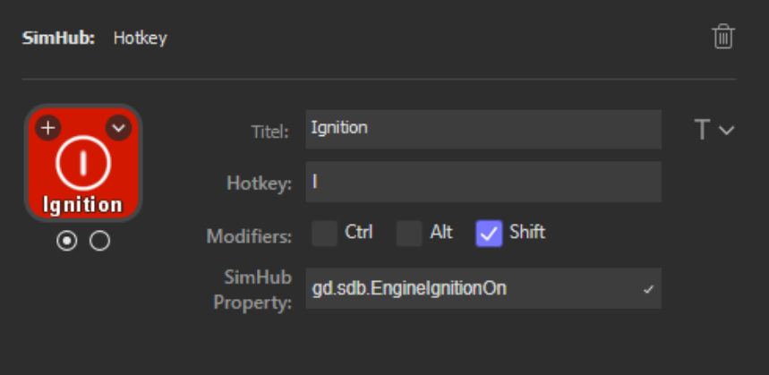
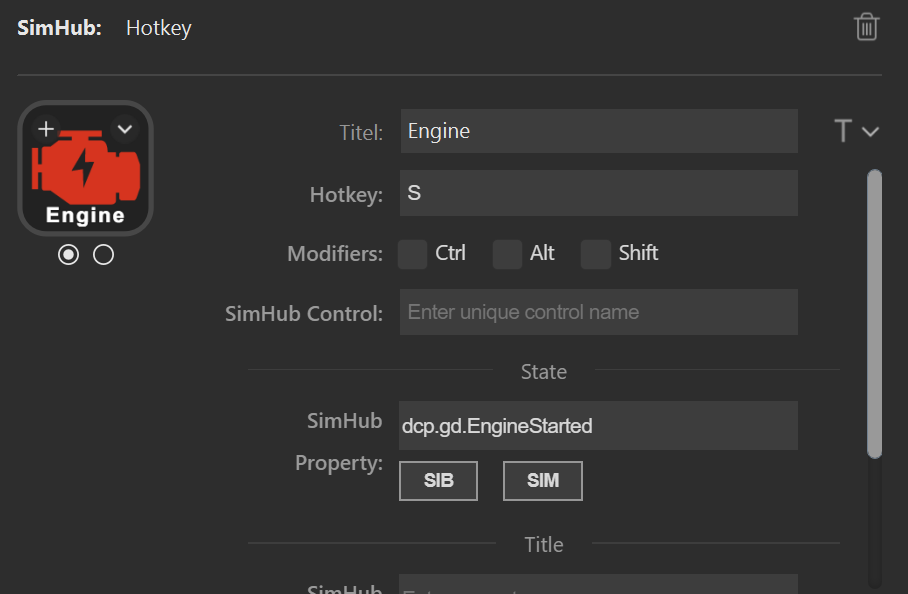

# Usage of the plugin

## Overview

After the installation of the Plugin, a new category named "SimHub" will be available in Stream Deck. Use the actions of this category to get Stream Deck buttons, which will update their state from SimHub properties.


## Actions offered by this plugin

### Hotkey

This action offers the same functionality as the built-in action "Hotkey": If the Stream Deck button is pressed, a keypress event will be sent to the active window. Please see the structure [VirtualKeyShort](/PluginNative/Tools/Keyboard.cs) for supported key names. For alphanumeric keys (0-1, A-Z) the prefix `KEY_` can be omitted, so either `KEY_P` and `P` will have the same result. Some examples of valid values for the field "Hotkey" are:

- `A` (will send the event for the key "A" to the active window)
- `KEY_A` (same as above)
- `SPACE` (will send an event for the space key)
- `F11` (event for F11)

Modifiers like Ctrl, Alt and Shift have to be specified by using the corresponding checkbox.

Please note, that not all entries in "VirtualKeyShort" make sense in the field "Hotkey".

The added value for this action is in the field "SimHub Property": It allows to enter the name of a SimHub property or even a logical expression with a SimHub property:

#### Simple SimHub property

Enter the name of a SimHub property. E.g.

```
dcp.gd.EngineIgnitionOn
```

The value of this SimHub property will update the state of the button. See [SimHub Property Server](https://github.com/pre-martin/SimHubPropertyServer) for a list of valid property names.

The logic for the action state depending on the SimHub property value is as follows:

- `boolean`: If the property value is `True`, the action will be in the "on" state, otherwise in the "off" state.
- `integer` and `long`: If the property value is greater than zero, the action will be in the "on" state, otherwise in the "off" state.

Examples:

- Button to toggle the Ignition in ACC (which is mapped to "Shift + I" by default):
  
- Button to toggle the Engine in ACC (which is mapped to "S" by default):
  
- Another useful button for ACC would be the Hotkey "Alt + L" with the SimHub property "gd.sdb.PitLimiterOn" to toggle the pit limiter.

#### SimHub property with logical expression

This allows a much finer grained logic for the button state. Enter the name of a SimHub property, a condition and a value. E.g.

```
acc.graphics.gapBehind<=500
```

In this example, the button would be in the state "on", if the gap behind is equal to or smaller than 500 milliseconds. It would be "off", if the gap behind is greater than 500 milliseconds. The field "Hotkey" could be empty in this example, so that the Stream Deck button could be used as an indicator only.

The following conditions are supported:

- `==` test for equal
- `>=`
- `>`
- `<=`
- `<`
- `!=` test for not equal
- `~~` test for "between two values", which means ">= value1 and <= value2"

The condition "between" requires two values, which have to be separated by a semicoolon, e.g.

```
acc.graphics.WiperLV~~1;2
```

The following table shows the comparison logic for different SimHub property types and comparison values (which are entered into the Stream Deck UI):

| SimHub property type | supported comparison values | evaluation rules                                            |
|----------------------|-----------------------------|-------------------------------------------------------------|
| boolean              | "true", "false"             | should be self explanatory                                  |
|                      | any integer value           | comp. value == 0: "false"<br/>comp. value > 0: "true"       |
| integer              | any integer value           | should be self explanatory                                  |
|                      | "true", "false"             | prop. value == 1: "true"<br>all other prop. values: "false" |
| long                 | same as "integer"           | same as integer                                             |
| double               | any integer or floating     | should be self explanatory                                  |


### Hotkey 4-state

This action is the same as the "Hotkey" action: It sends a keystroke to the active window, and it can be connected to a SimHub property, which will update its state.

The difference is that this action can have up to four states. The logic for the action state in dependency from the SimHub property value is as follows:

- `boolean`: If the property value is `True`, the action will be in the state "1", otherwise in the state "0" state.
- `integer` and `long`: The property value will directly set the state. The value "0" maps to the action state "0", "1" to the action state "1" and so on.

Unfortunately, the Stream Deck UI support is very limited for actions which have more than two states. "Title" and icon can only be customized for the first two states. Maybe Stream Deck will enhance their UI one day to allow customization of all states. 
