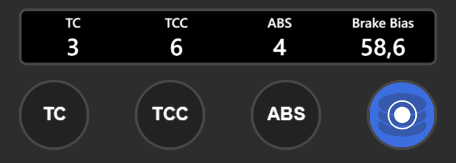
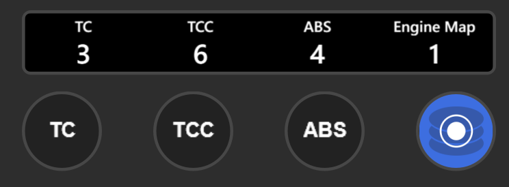
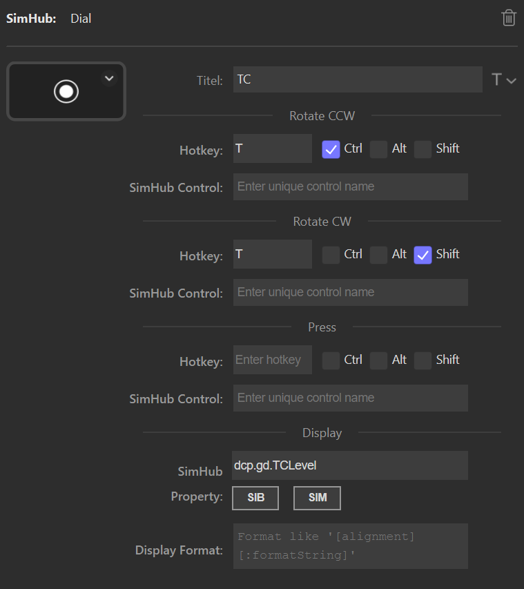
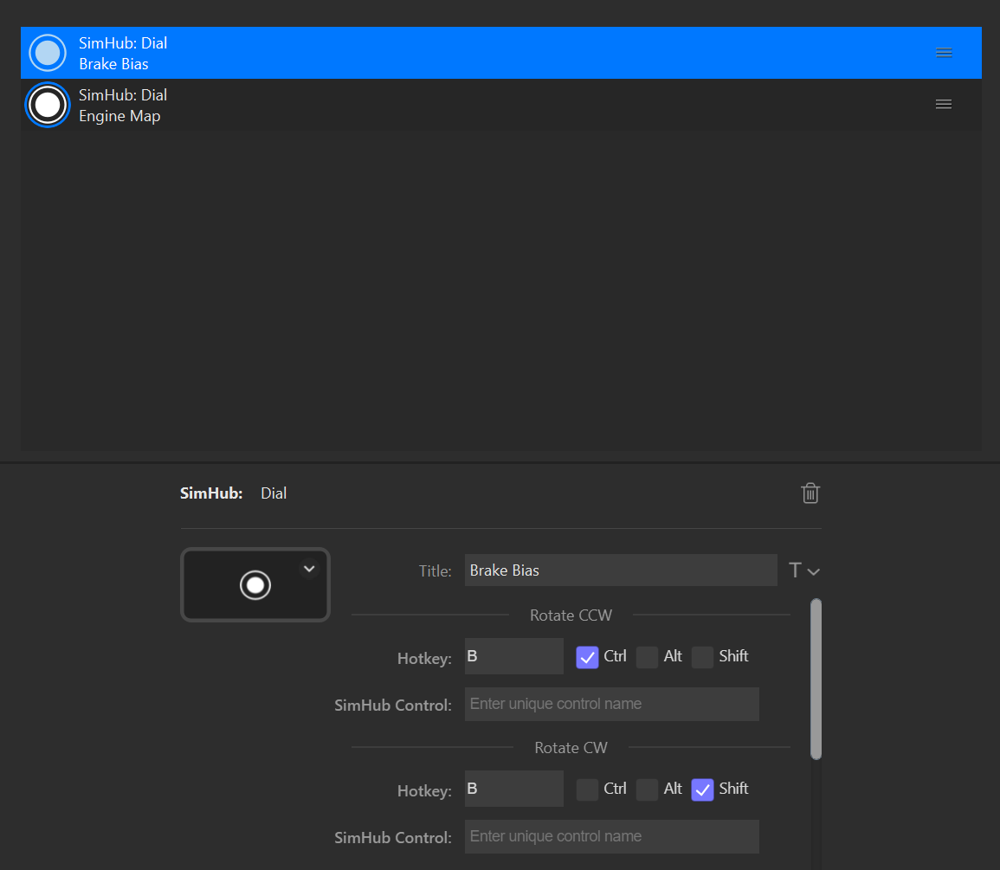

= Action "Dial" (Stream Deck Plus only)
:toc:
:sectnums:
ifdef::env-github[]
:tip-caption: :bulb:
endif::[]
ifndef::env-github[]
:tip-caption: 💡
endif::[]

TIP: Always read the *correct version* of the documentation, which matches the version of the plugin that you have installed. To do so, use the dropdown in the top left, which usually contains the value "main". Select the "tag" that matches your installed version.

== Description

This action is very similar to the "Hotkey" action, with the difference that the "Dial" action can be used for the rotary encoders of the Stream Deck Plus. The features are as follows:

* Send a keystroke event to the active window, if a rotary knob is rotated or pressed.
* Send an input trigger to SimHub, if a rotary knob is rotated or pressed.
* Send a mapped SimHub control mapper role, if a rotary knob is rotated or pressed.
* Show the value of a SimHub property on the display

The fields of this action are as follows:

Section Rotate CCW::

* *Hotkey* +
This optional field takes a key, which should be sent to the active window, when the rotary knob is turned counterclockwise. Please see the description of the link:../hotkey/Hotkey.adoc[Hotkey.adoc] for details.
* *SimHub Control* +
This optional field may take a *unique* string. This string will be sent as an input trigger to SimHub, when die rotary knob is turned counterclockwise. Again, see link:../hotkey/Hotkey.adoc[Hotkey.adoc] for details.
* *SimHub (Control Mapper) Role* +
Allows the mapping of predefined roles from the SimHub Control Mapper plugin. See link:../hotkey/Hotkey.adoc[Hotkey.adoc] for details.

Section Rotate CW::

* *Hotkey*, *SimHub Control* and *SimHub (Control Mapper) Role* +
Same as above, but for clockwise rotation of the knob.

Section Press::

* *Hotkey*, *SimHub Control* and *SimHub (Control Mapper) Role* +
Same as above, but when the rotary knob is pressed.

Section State::

* *SimHub Property (for state)* +
This optional field allows to enter the name of a SimHub property or even a logical expression with a SimHub property. The SimHub property or the result of the logical expression will be used to set the state of the button to either "on" or "off". The section link:../hotkey/Hotkey.adoc[Hotkey.adoc] contains extensive documentation for this topic.

Section Display::

* *SimHub Property (for display)* +
This optional field allows to specify a SimHub property, which will be shown in the display of the rotary knob. The section link:../hotkey/Hotkey.adoc[Hotkey.adoc] contains extensive documentation on the use of SimHub properties.
* *Display Format (for display)* +
Another optional field. If set, the SimHub property shown on the display will be formatted with this format string. Again, see link:../hotkey/Hotkey.adoc[Hotkey.adoc] for extensive documentation of the format string.

== Examples

=== TC, TCC, ABS, Brake Bias and Engine Map in ACC

Because the rotary knobs can also be used in stacks, it is possible to address more than just 4 functions. The following is an example where TC, TCC, ABS, Brake Bias and Engine Map in ACC can be controlled with 4 knobs.

==== TC in ACC

The traction control can be mapped to a rotary knob as follows:

[%autowidth]
|===
| Field | Value

| Title            | TC
| CCW              | Ctrl + T
| CW               | Shift + T
| Display property | dcp.gd.TCLevel
|===

==== TCC in ACC

[%autowidth]
|===
| Field | Value

| Title            | TCC
| CCW              | Ctrl + Y
| CW               | Shift + Y
| Display property | dcp.gd.TCCut
|===

==== ABS in ACC

[%autowidth]
|===
| Field | Value

| Title            | ABS
| CCW              | Ctrl + A
| CW               | Shift + A
| Display property | dcp.gd.ABSLevel
|===

==== Brake Bias and Engine Map on the same Dial

. Drag a "Dial Stack" from the category "Stream Deck" onto the dial. The application will automatically switch to the configuration window for dial stacks.
. Drag two "Dial" actions from the category "SimHub" (this plugin) onto the dial stack
. The first one will be used for Brake Bias: +
+
[%autowidth]
|===
| Field | Value

| Title            | Brake Bias
| CCW              | Ctrl + B
| CW               | Shift + B
| Display property | dcp.gd.BrakeBias
| Display format   | :F1
|===
. The second one will be used for Engine Map: +
+
[%autowidth]
|===
| Field | Value

| Title            | Engine Map
| CCW              | Ctrl + E
| CW               | Shift + E
| Display property | dcp.gd.EngineMap
|===

By pressing the dial knob it is now possible to switch between Brake Bias and Engine Map.

Perhaps the option "Show Dial Stack icon" of the Dial Stack should be disabled so that the long titles do not interfere with this icon.

=== ShakeIt (Bass Shakers / Motors) with a Dial

See link:../shakeit/ShakeIt.adoc[ShakeIt.adoc] for an example with a rotary knob.
