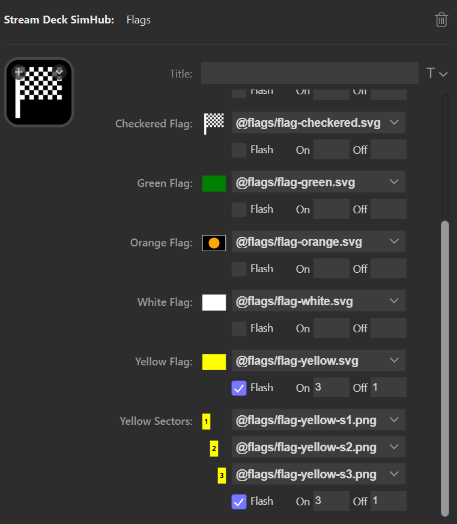
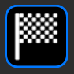
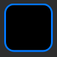
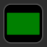
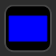

= Flags
:toc:
:sectnums:
ifdef::env-github[]
:tip-caption: :bulb:
endif::[]
ifndef::env-github[]
:tip-caption: 💡
endif::[]

TIP: Always read the *correct version* of the documentation, which matches the version of the plugin that you have installed. To do so, use the dropdown in the top left, which usually contains the value "main". Select the "tag" that matches your installed version.

== Description

This is a special button that displays the race flags:

All flags can be customized by selecting different images.

== Custom Images

The plugin lists all images which are in the following directory and its subdirectories:

----
%appdata%\Elgato\StreamDeck\Plugins\net.planetrenner.simhub.sdPlugin\images\custom
----

This string can be copied like it is into the address bar of the File Explorer, which will open the directory `C:\Users\yourname\AppData\Roaming\...`.

Custom images can be copied into this directory or a subdirectory. The folder `images\custom` will not be deleted during upgrades of the plugin.

The plugin supports the following file formats:

* SVG
* PNG
* JPEG
* GIF

SVG is the format recommended by Elgato, because it is a vector format and can therefore be scaled without loss. If SVG files are not available (or the library used by the plugin is not able to decode the SVG image), one of the bitmap formats has to be used, preferably PNG.

Bitmap formats follow the same standard as Elgato: `myimage.png` should have a resolution of 72 x 72 pixels and will be used for the devices with standard resolution (Stream Deck, Stream Deck Mini). `myimage@2x.png` should have a resolution of 144 x 144 pixels and will be used for the high resolution devices (Stream Deck XL, Stream Deck +). If no `@2x` image is available for a high resolution device, the regular will be used as fallback.

The images should never be larger than 144 x 144 pixels, because the plugin keeps the images in memory. Larger images cost unnecessary memory and performance.

The plugin only ever lists the base name of the image, and it will choose the correct resolution at runtime. So even if there are `myimage.png` and `myimage@2x.png` in the folder, the plugin will only list `myimage.png`, but use `myimage@2x.png`, if the device is a high-res device.

Unfortunately, the Stream Deck SDK does not support animated GIF images - only static GIF images.

== Behavior

When no race is active, the plugin displays the "Checkered Flag":

When a race is active, but no flags are shown, it shows the "No Flag" image:

Otherwise, it shows the currently active flag, like the green or the blue flag:

The button currently supports the following flags (depending on the simulation):

[%autowidth]
|===
| Flag | Summary

| Black           | Disqualification
| Blue            | Faster vehicles approaching
| Checkered       | End of Session
| Green           | Start of race/End of Caution/Pit Lane open
| Orange          | Mechanical problem
| White           | Slow moving vehicle ahead
| Yellow          | Caution
| Yellow Sector 1 | Caution in sector 1
| Yellow Sector 2 | Caution in sector 2
| Yellow Sector 3 | Caution in sector 3
|===

== Sector Flags

If the game supports yellow flags for sectors (ACC does), the plugin will derive an image from "Yellow Sec 1", "Yellow Sec 2" and "Yellow Sec 3". For example, if yellow flags are active in sector 1 and 3, the plugin will combine the images "Sec 1" and "Sec 3" into a new image, which will then be displayed on the button.

It must therefore be ensured that these three images can be stacked visually on top of each other.
