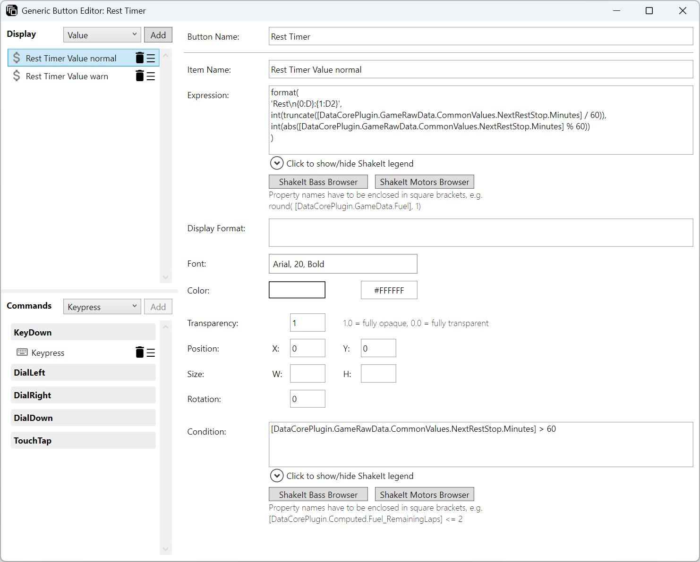
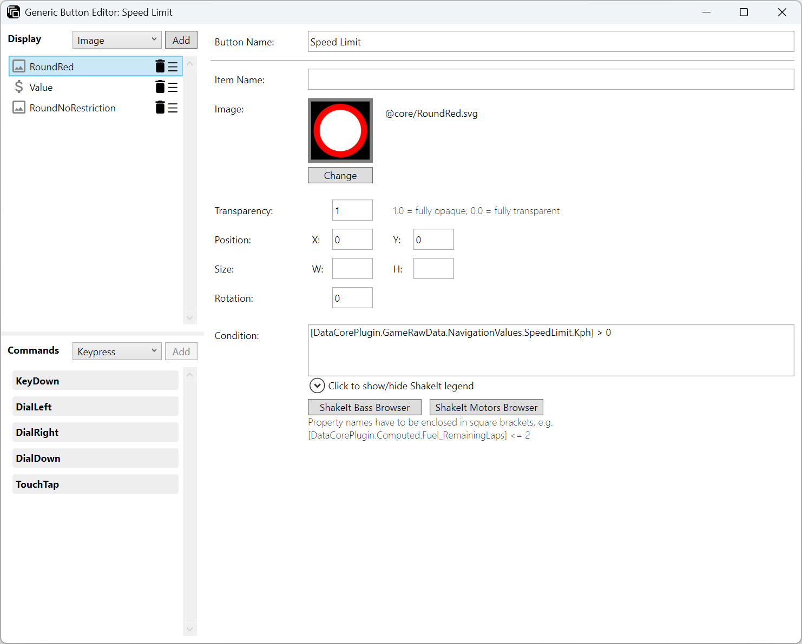
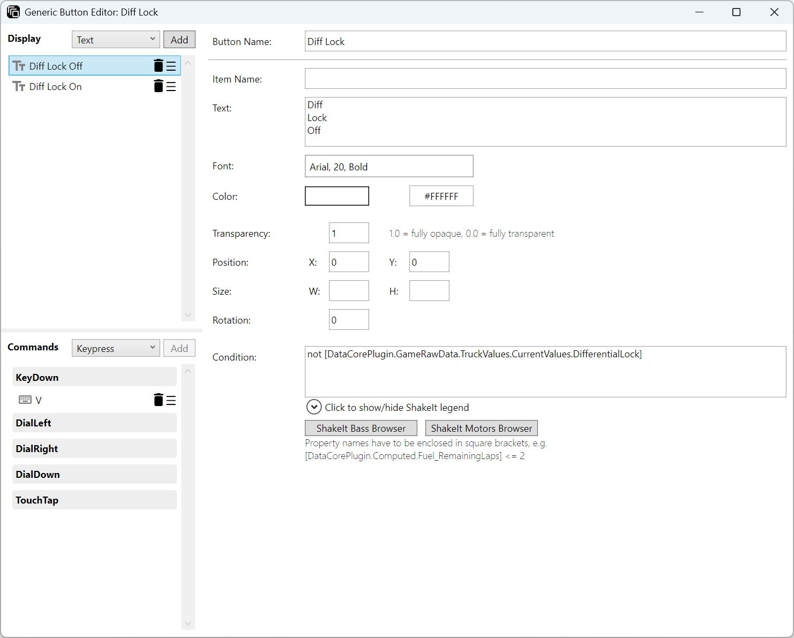
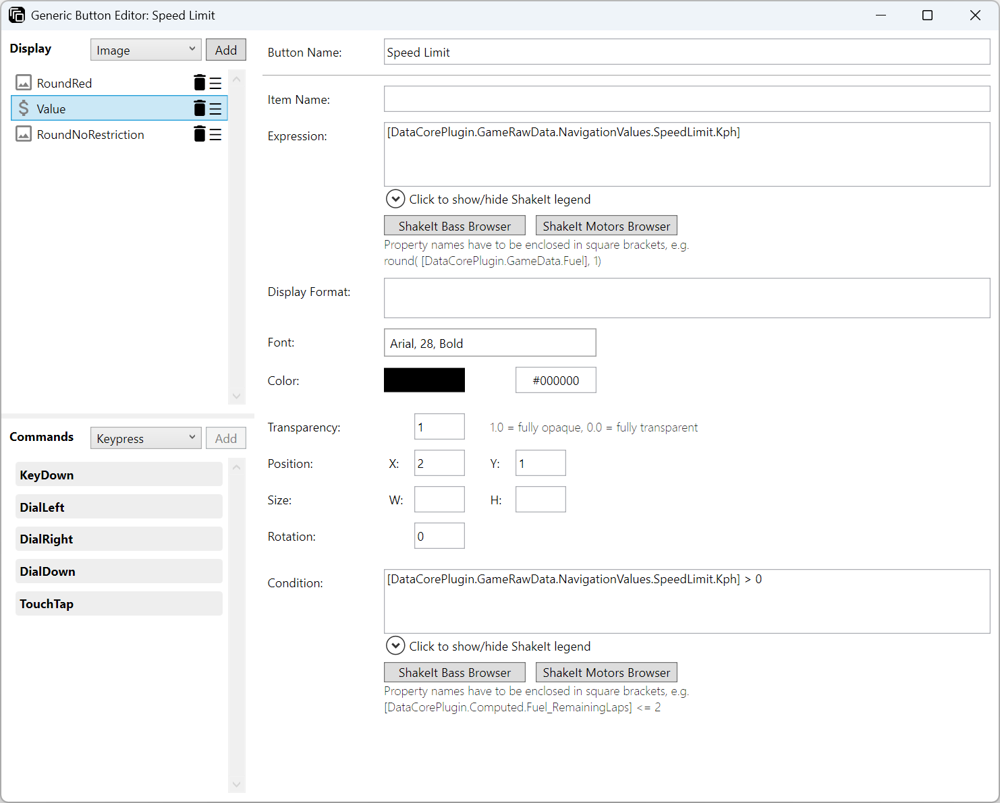
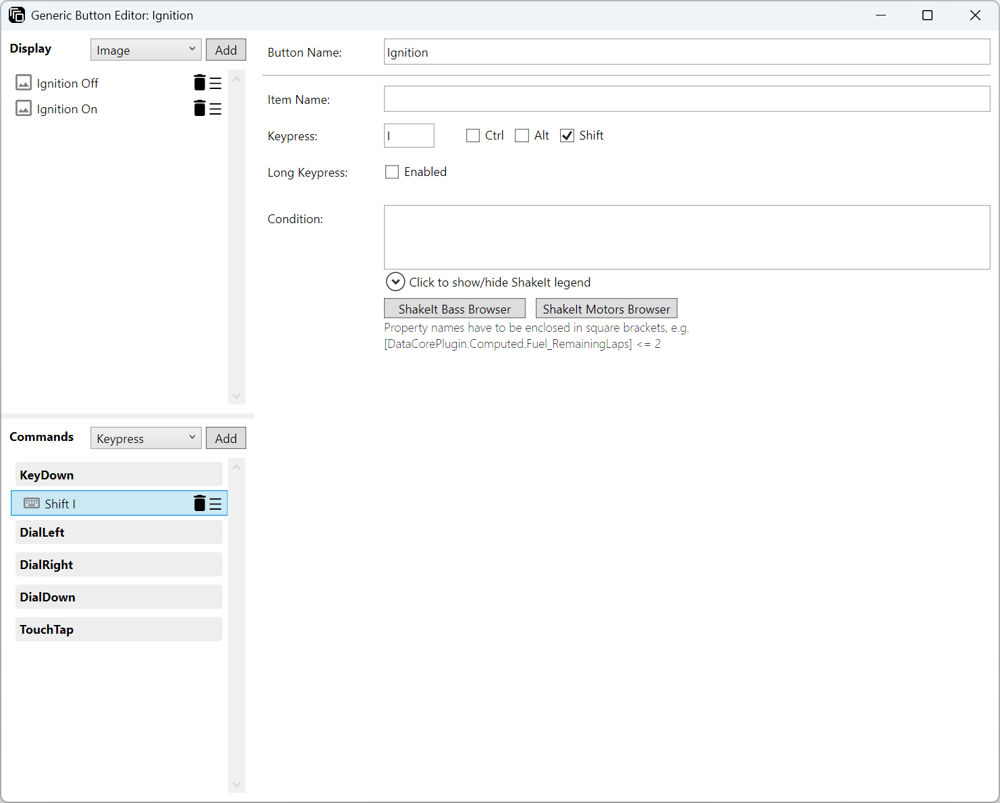
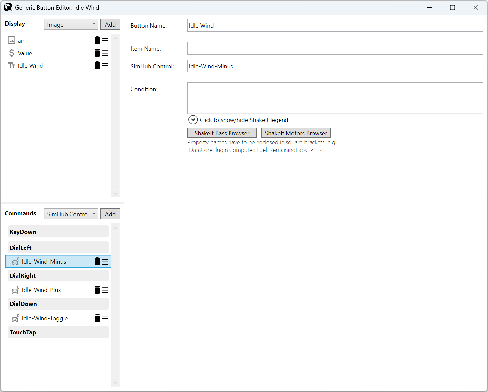
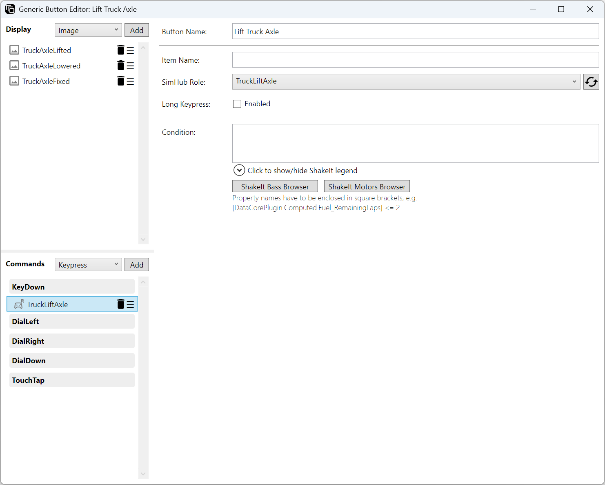
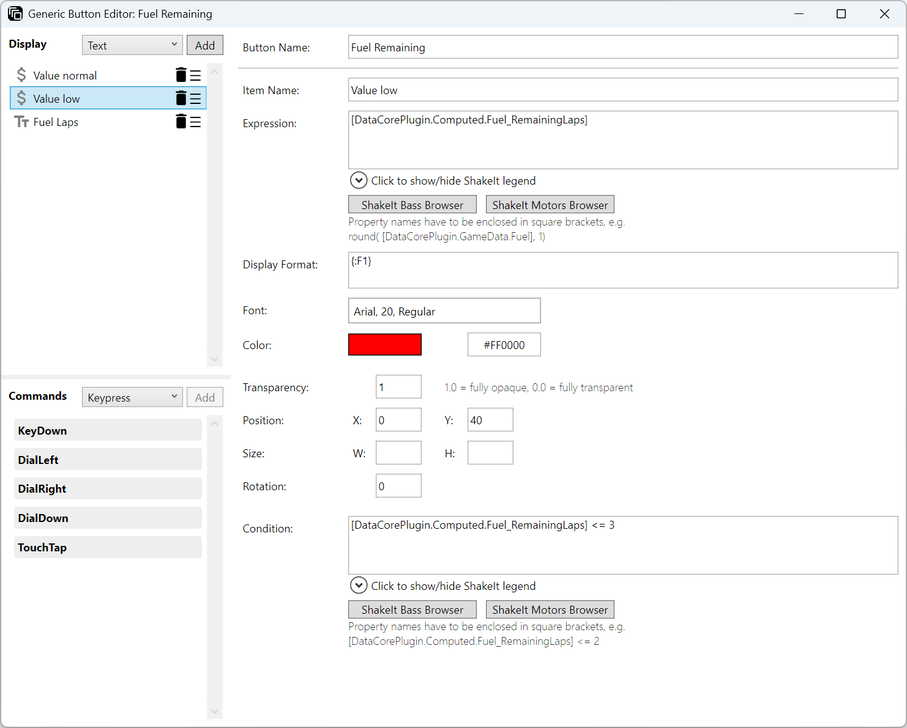
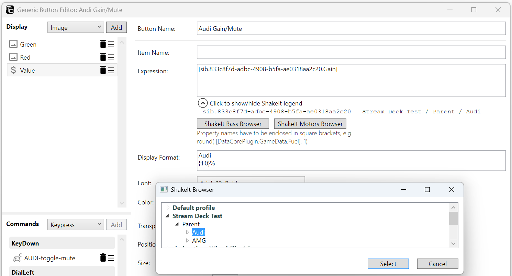

= Action "Generic Button"
:toc:
:toclevels: 3
:sectnums:
ifdef::env-github[]
:tip-caption: :bulb:
:warning-caption: :warning:
endif::[]
ifndef::env-github[]
:tip-caption: 💡
:warning-caption: ⚠️
endif::[]

TIP: Always read the *correct version* of the documentation, which matches the version of the plugin that you have installed. To do so, use the dropdown in the top left, which usually contains the value "main". Select the "tag" that matches your installed version.

== Description

The Generic Button action offers a highly flexible way to control your Stream Deck, making it easy to create dynamic and powerful buttons for your setup.

Key features include:

* *Dynamic Icon Display*: +
You can assign multiple icons to a single button. Each icon can be shown or hidden based on condition expressions, allowing your button to visually respond to changes in your game or system.
* *Dynamic Value Display*: +
You can display values on your button, which can be based on dynamic expressions bound to SimHub properties. This allows you to combine different values on the same button, or to adjust and format the values of SimHub properties.
* *Multiple Commands per Button*: +
Each button can execute several commands. You can configure which commands are triggered and when, giving you full control over your Stream Deck’s behavior.
* *Conditional Command Execution*: +
Commands can be bound to condition expressions, so they only run when specific criteria are met. This makes your buttons smarter and more context-aware.
* *Supports both Stream Deck Keys and Stream Deck Dials*

== UI Overview

The editor consists of three main sections:

1. *Display Configuration* in the upper-left corner
2. *Command Configuration* in the lower-left corner
3. *Detail Area* on the right side

=== Display Configuration

This list in the upper-left corner of the editor contains all items that can be displayed on the button. You can

* add new items by selecting the desired item type in the drop-down menu and clicking on "Add"
* remove them by clicking on the trash icon on the right side of the item
* change their order by dragging the burger icon (three horizontal lines) on the right side of the item

The order of the items is important, as the items are rendered in the order they appear in the list. This allows you to create complex layouts by drawing different items on top of each other.

Each item can be configured to show or hide based on condition expressions.

=== Command Configuration

This list in the lower-left corner of the editor contains all commands that can be executed by the button. The list always contains all possible events, but if you assign the Generic Button to a Stream Deck Key, only "KeyDown" will actually be executed. The same applies to Stream Deck Dials, where only the "Dial" and "Touch" events are executed.

As for the display configuration, you can add new commands, remove them, or change their order. The "Add" button will only be active if an event like "KeyDown" or any command inside an event is selected first.

The order is again important, as commands are executed in the order they appear in the list.

Each command can be configured to run only when a condition expression is met.

=== Detail Area

The detail area allows to configure the selected display or command item.

== Configuration

=== Common Properties

==== Button Name

Each button can have a name, which is displayed in

* the title of the Generic Button Editor
* the top line in the detail area
* in the Stream Deck Property Inspector

Since the display items of a given button may only be visible when certain SimHub properties have certain values, it can be hard to identify the button in the Property Inspector when SimHub is not running or a different game is selected in SimHub. By giving the button a name, you can easily identify it in the Property Inspector without having to open the editor.

==== Item Name

Each display item and each command item can have a name, which is displayed in the relevant list on the left side of the editor. You can use this to give the items meaningful names. If no name is given, the name will be automatically generated based on the type of the item and its properties.

==== Condition Expression

If a condition is given, it will determine whether the display item will be shown or whether the command will be executed. The condition expression is evaluated at runtime, and if it evaluates to `true` or a number `> 0`, the item will be shown or the command will be executed.

The expression itself must be a valid NCalc expression. Read more about NCalc expressions in the section <<#ncalcExpressions>> below.

If no condition is given, the display item will always be shown or the command will always be executed.

=== Display Items

The following sections describe the available display items.

All items have the field "Size". If this is empty, the size of the Stream Deck key will be used as a bounding box. If values are given, these given values specify the bounding box of the item. The item will be scaled to fit into this bounding box.

If a rotation is given, the item will be rotated around the center of the bounding box.

==== Display Item "Image"

Displays an image on the button.

===== Field "Image"

When clicking on the button "Change", the editor lists all images which are located in the following directory and its subdirectories:

----
%appdata%\Elgato\StreamDeck\Plugins\net.planetrenner.simhub.sdPlugin\images\custom
----

This string can be copied like it is into the address bar of the File Explorer, which will open the directory `C:\Users\yourname\AppData\Roaming\...`.

Custom images can be copied into this directory or a subdirectory. The folder `images\custom` will not be deleted during upgrades of the plugin.

WARNING: Images that were originally delivered by the plugin will be overwritten during the update! Do not modify these images or your changes will be lost after an upgrade. You can recognize them by the fact that they are located in directories that begin with “@”. It is therefore advisable to create files and folders without the prefix "@".

The plugin supports the following file formats:

* SVG
* PNG
* JPEG
* GIF

SVG is the format recommended by Elgato, because it is a vector format and can therefore be scaled without loss. If SVG files are not available (or the library used by the plugin is not able to decode the SVG image), one of the bitmap formats has to be used, preferably PNG.

Bitmap formats follow the same standard as Elgato: `myimage.png` should have a resolution of 72 x 72 pixels and will be used for the devices with standard resolution (Stream Deck, Stream Deck Mini). `myimage@2x.png` should have a resolution of 144 x 144 pixels and will be used for the high resolution devices (Stream Deck XL, Stream Deck +). If no `@2x` image is available for a high resolution device, the regular will be used as fallback.

If you have a high-res Stream Deck and don't want to transfer your profile onto a standard-res Stream Deck, you can omit the suffix in the file name and scale the images to 144 x 144 pixels.

The images used for the touch bar of SD+ dials should have a resolution of 200 x 100 pixels.

The images should never be larger than 144 x 144 pixels (or 200 x 100 pixels for SD+ dials), because the plugin keeps the images in memory. Larger images cost unnecessary memory and performance.

The plugin only ever lists the base name of the image, and it will choose the correct resolution at runtime. So even if there are `myimage.png` and `myimage@2x.png` in the folder, the plugin will only list `myimage.png`, but use `myimage@2x.png`, if the device is a high-res device.

Unfortunately, the Stream Deck SDK does not support animated GIF images - only static GIF images.

===== Field "Condition"

See section <<#ncalcExpressions>> below for more information about NCalc expressions.

===== Other Fields

Their usage should be self-explanatory.

==== Display Item "Text"

Displays some static text on the button.

===== Field "Text"

The text to display on the button. For multiline text, simply press Enter to create a new line.

===== Field "Condition"

See section <<#ncalcExpressions>> below for more information about NCalc expressions.

===== Other Fields

Their usage should be self-explanatory.

==== Display Item "Value"

Displays a value on the button, that usually comes from one or more SimHub properties.

This is the most powerful display item, as it allows complex expressions to be evaluated and displayed on the button.

Basically, everything from the SimHub tab "Available properties" can be used in the expression, and you can also use mathematical operations, string operations, and more. In addition, `Gain` and `IsMuted` are available for all SimHub ShakeIt Bass and ShakeIt Motors effects (see section <<#shakeit>> below).

===== Fields "Expression" and "Condition"

See section <<#ncalcExpressions>> below for more information about NCalc expressions.

===== Field "Display Format"

This field allows you to format the value that is displayed on the button. See section <<#formatting>> below for more information about formatting.

This field supports the simple format and the full format.

Note that the expression itself also has a function "format()" (see <<#ncalcExpressions>> below).

===== Other Fields

Their usage should be self-explanatory.

=== Command Items

The following sections describe the available command items.

==== Command Item "Keypress"

Allows you to send a keypress event to the currently focused application.

===== Field "Keypress"

Enter the key that should be sent to the focused application. Please see the structure link:/StreamDeckSimHub.Plugin/Tools/Keyboard.cs[VirtualKeyShort] for supported key names. For alphanumeric keys (0-1, A-Z) the prefix `KEY_` can be omitted, so either `KEY_P` and `P` will have the same result.

Some examples of valid values for the field "Keypress" are:
* `A` (will send the event for the key "A" to the active window)
* `KEY_A` (same as above)
* `SPACE` (will send an event for the space key)
* `F11` (event for F11)

Please note, that not all entries in "VirtualKeyShort" make sense in the field "Hotkey".

[#fieldLongKeypress]
===== Field "Long Keypress"

This field is only available on "KeyDown" and "DialDown" events. For the other dial and touch events, it does not make sense.

If this field is enabled for at least one command item in the list (regardless of whether command items are enabled or disabled with a "Condition"), the behavior of all command items in this list will change.

====== Disabled

With the field disabled for all command items, the plugin sends a "KeyDown" event for each active Keypress item to Windows, as soon as the Stream Deck key is pressed. When the Stream Deck key is released, a "KeyUp" event is sent for the same list of Keypress items to Windows. This means that the behavior is exactly the same as when you press a key on your keyboard and perhaps hold it down for some longer time. For example, if the active window is an editor, the pressed key is repeated until it is released.

====== Enabled

With the field enabled for at least one command item, the plugin has to detect whether the Stream Deck key is pressed for a short or long time. Unfortunately, this can only be detected if the key has been pressed for a certain time.

Therefore, the behavior is now as follows:

When the Stream Deck key is pressed, nothing happens at first.

If the key is released before 500 milliseconds have elapsed, this is interpreted as a "short keystroke". The plugin sends "KeyDown" events for each active Keypress item, then waits 20 milliseconds, and finally sends "KeyUp" events for the same list of Keypress items. For the application it looks like the keys have been pressed and held for 20 milliseconds.

If 500 milliseconds have elapsed and the key is still held down, this is interpreted as a "long keystroke". The plugin sends "KeyDown" events to Windows, and "KeyUp" events as soon as the key is released.

*Important:* The "KeyDown" events are only sent, when either the Stream Deck key is *released* before 500 milliseconds, or if 500 milliseconds have elapsed. Thus, the target application will not react immediately, when the key is pressed.

===== Field "Condition"

See section <<#ncalcExpressions>> below for more information about NCalc expressions.

==== Command Item "SimHub Control" and "SimHub Role"

Both command items are similar, but they are used for different purposes:

* A *SimHub Control* is used to trigger some action in SimHub. The unique control name has to be entered into the field "SimHub Control". See link:../inputtrigger/InputTrigger.adoc[InputTrigger.adoc] for details about input triggers and how they can be used in SimHub. +
 
* A *SimHub Role* is used to trigger a predefined Control Mapper Role in SimHub. SimHub allows the abstraction of input devices with its Control Mapper plugin. The role has to be selected in the dropdown field, which shows all available roles that have been defined in SimHub. +
 Important: SimHub has to be running because the available roles are fetched online from SimHub. +
 If you modify the roles in SimHub while the Generic Button Editor is open, you can reload the available roles with the "Reload" button. +
 

===== Field "Long Keypress"

See section <<#fieldLongKeypress>> of the "Keypress" command above for details about the behavior of this field. The only difference is, that "Control Pressed" / "Control Released" events are sent for SimHub Controls, and "Start Role" / "Stop Role" events for SimHub Roles.

Note: SimHub has its own detection logic of short and long presses for SimHub Controls (not SimHub Roles). Activating this field for SimHub Controls could be confusing.

===== Field "Condition"

See section <<#ncalcExpressions>> below for more information about NCalc expressions.

[#ncalcExpressions]
== NCalc Expressions

The usage of NCalc expressions is another key feature of the Generic Button action. NCalc expressions are used in two places:

* In the "Condition" field of display items and command items to determine whether the item is shown or the command is executed. The condition expression is evaluated at runtime, and if it evaluates to `true` or a number `> 0`, the item will be shown or the command will be executed.
* In the "Expression" field of the display item "Value" to determine which value is displayed on the button.

=== Syntax

Please refer to the NCalc documentation for details about the syntax of NCalc expressions:

* https://ncalc.github.io/ncalc/articles/functions.html
* https://ncalc.github.io/ncalc/articles/operators.html
* https://ncalc.github.io/ncalc/articles/values.html

SimHub properties can be used by putting their name into square brackets, e.g.

* `[DataCorePlugin.GameData.EngineIgnitionOn]`
* `[DataCorePlugin.Computed.Fuel_RemainingLaps]`
* `[DataCorePlugin.GameRawData.TruckValues.CurrentValues.DashboardValues.FuelValue.Range]` (ETS2).

As a practical example, one could display the property value `[DataCorePlugin.Computed.Fuel_RemainingLaps]` in white font with the condition `[DataCorePlugin.Computed.Fuel_RemainingLaps] > 3` and in red font with the condition `[DataCorePlugin.Computed.Fuel_RemainingLaps] <= 3`:

=== Custom Functions

In addition to the built-in functions (see links above), the following functions are also available:

==== int()

Format:
----
int(value: object)
----

Converts the given value into an integer.

This is useful for formatting purposes. For example, the expression `60 / 10` returns a *floating point* number. If you want to use a standard formatting string like `{:D2}` to prepend leading zeros, you will get the error message "_Format specifier was invalid_", because `D` is a standard numeric format string for *integer* types. Even using the NCalc built-in functions like `floor()`, `ceiling()`, `truncate()` or `round()` does not fix this, as these functions do not modify the data type.

`int(60 / 10)` solves this problem, so that you can use `{:D2}` as a format string. For exactly this example (leading zeros), a custom numeric format string can also be used as an alternative: `{:00}` instead of `int()`.

==== str()

Format:
----
str(value: object)
----

Converts the given value into a string.

This is useful if you want to use string concatenation in the expression. By default, NCalc tries to interpret everything as a number. So the expression `'Fuel: ' + [DataCorePlugin.Computed.Fuel_RemainingLaps]` will yield an error, because NCalc tries an arithmetic addition of the two operands. To get a string concatenation, you have to write `'Fuel: ' + str([DataCorePlugin.Computed.Fuel_RemainingLaps])` instead.

==== format()

Format:
----
format(format: string, parameters: object[])
----

This is a very powerful function that allows formatting of individual values inside (!) of the expression.

The parameters are passed directly to the C# `string.Format()` method. So the format is the "full format" (see section <<#formatting>> below), but position parameters must also be specified. The syntax is:
----
{index[,width][:formatString]}
----
See https://learn.microsoft.com/en-us/dotnet/standard/base-types/composite-formatting

A very basic example is the following expression:
----
format('{0:D2} / {1:F1} / {2:D3}', 5, 3.33, 12)
----

which will output the text `05 / 3.3 / 012` on the button.

If you are using Euro Truck Simulator 2 (ETS2), an example with real SimHub properties could be:
----
format(
'Rest\n{0:F0}:{1:00}',
truncate([DataCorePlugin.GameRawData.CommonValues.NextRestStop.Minutes] / 60),
abs([DataCorePlugin.GameRawData.CommonValues.NextRestStop.Minutes] % 60)
)
----

This will output the time left (in hours and minutes) until the next rest stop. As the property can have negative values, we want to preserve the sign for the hours, but not for the minutes (which explains the usage of `abs()` for the minutes). As both values are floating point numbers, we can use the standard numeric format string `:F0` for the hours, and the custom numeric format string `:00` for the minutes to always display two digits with leading zeros if necessary. If you have 91 minutes left, the output will be `1:31`, if you are 9 minutes overdue, the output will be `-0:09` (with the text "Rest" on the first line).

[#shakeit]
=== ShakeIt Bass & ShakeIt Motors Effects

In addition to accessing the normal SimHub properties (SimHub, tab "Available properties"), the plugin also allows access to `Gain` and `IsMuted` of the ShakeIt Bass and ShakeIt Motors effects.

These properties must be addressed via a GUID, as SimHub manages effect groups and effects internally via GUIDs.

The syntax to access ShakeIt Bass properties is
----
[sib.guid.Gain]
[sib.guid.IsMuted]
----
for ShakeIt Motors, the syntax is
----
[sim.guid.Gain]
[sim.guid.IsMuted]
----
where `sib` and `sim` are the predefined prefixes for ShakeIt Bass and ShakeIt Motors, and `guid` is the GUID of the effect group or effect.

Unfortunately, SimHub does not display these GUIDs in the UI and there is no possibility to access them somehow in SimHub. This is where the two buttons "ShakeIt Bass Browser" and "ShakeIt Motors Browser" and the expander directly below the input field come into play: The buttons open a dialog box where the SimHub effects can be selected, and the expander displays a legend for the GUIDs.

After opening one of the ShakeIt Browsers, you get a tree view of all available effect profiles and their nested effect groups and effects. When you select an effect group or an effect and press the "Select" button, the whole property name is inserted into the input field at the current cursor position. Currently, the "Gain" property is always inserted. For "IsMuted" the property must be edited manually and `Gain` must be replaced with `IsMuted`. Care must be taken to ensure that the GUID is not accidentally changed.

When the expander right below the input field is expanded (like in the screenshot above), it shows a legend for the GUIDs and their full names. This is a little help to somehow identify the meaningless property names with their GUIDs. Unfortunately, this process is not yet optimal.

The screenshot above shows the selected effect group "Audi" in the browser. If "Select" is pressed, it will insert the property name into the "Expression" field. The expander below the "Expression" field shows, that this lengthy GUID actually belongs to the effect group "Audi".

[#formatting]
== Formatting

Two options are available: A "*simple format*" and a "*full format*". The main difference is, that the "simple format" only allows a width and a format string, whereas the "full format" allows a combination of static text plus the features of the "simple format".

**Note**: If you use an invalid format string in the expression field with the function `format()`, you will usually receive an error message directly below the expression field because the expression is evaluated as you type. If you use an invalid format string in the field "Display Format", you need to check the log file `StreamDeckSimHub.log`, because the entry in "Display Format" is only evaluated during rendering.

=== Simple Format

The simple format has this syntax:

----
[width][:formatString]
----

If the format is invalid, the default formatter of the type is used as a fallback.

`width` is optional. It is a signed integer that indicates the total length of the text and whether it is right-aligned (a positive integer) or left-aligned (a negative integer)

`:formatString` is optional. It has to start with `:` (colon), and it has to be a valid C# format string.

Technically, the above syntax is the inner part of a C# format string. For details see:

* https://learn.microsoft.com/en-us/dotnet/fundamentals/runtime-libraries/system-string-format#the-format-item
* https://learn.microsoft.com/en-us/dotnet/standard/base-types/standard-numeric-format-strings
* https://learn.microsoft.com/en-us/dotnet/standard/base-types/custom-numeric-format-strings
* https://learn.microsoft.com/en-us/dotnet/standard/base-types/standard-date-and-time-format-strings
* https://learn.microsoft.com/en-us/dotnet/standard/base-types/custom-date-and-time-format-strings
* https://learn.microsoft.com/en-us/dotnet/standard/base-types/standard-timespan-format-strings
* https://learn.microsoft.com/en-us/dotnet/standard/base-types/custom-timespan-format-strings

Here are a few examples for the "Display Format" that should already cover a large number of cases. `_` is used in these examples to indicate a space in the generated output:

Only width::

* Display format `-3` will display the value left-aligned with a length of 3 digits:
** Property value `1` is displayed as `1__`
** Property value `34` is displayed as `34_`
** Property value `250` is displayed as `250`
* Display format `3` will display the value right-aligned with a length if 3 digits:
** Property value `1` is displayed as `__1`
** Property value `34` is displayed as `_34`
** Property value `250` is displayed as `250`

Only formatString::

* Display format `:F0` will display the value as a fixed-point value without decimal digits:
** `34.3333333` will be displayed as `34`
** `34.55` will be displayed as `35`
* Display format `:F1` will display the value as a fixed-point value with 1 decimal digit:
** `34.3333333` will be displayed as `34.3`
** `34.55` will be displayed as `34.6`

Both::

* Display format `3:F0` will display the value right-aligned with a length of 3 and without decimal digits:
** `34.3333333` will be displayed as `_34`
** `3.55` will be displayed as `__4`
* Display format `4:F1` will display the value right-aligned with a length of 4 and with 1 decimal digit:
** `3.55` will be displayed as `_3.6`
** `31.55` will be displayed as `31.6`

All characters are counted for the width - including decimal separator and decimal digits.

=== Full Format

The full format has this syntax:

----
[prefix text] {[width][:formatString]} [suffix text]
----

The full format allows the same formatting features as the simple format, but the format can be combined with static text before and after the format. The width and the format string have to be put into curly braces in order to be recognized. So a format in the full format may look like

----
Bias: {:F1}
----

or

----
FPS: {5:F1}
----

Line breaks are also allowed, therefore a line break could be inserted in this example between `Bias:` and `{:F1}`, so that the entire content fits better on a button.
