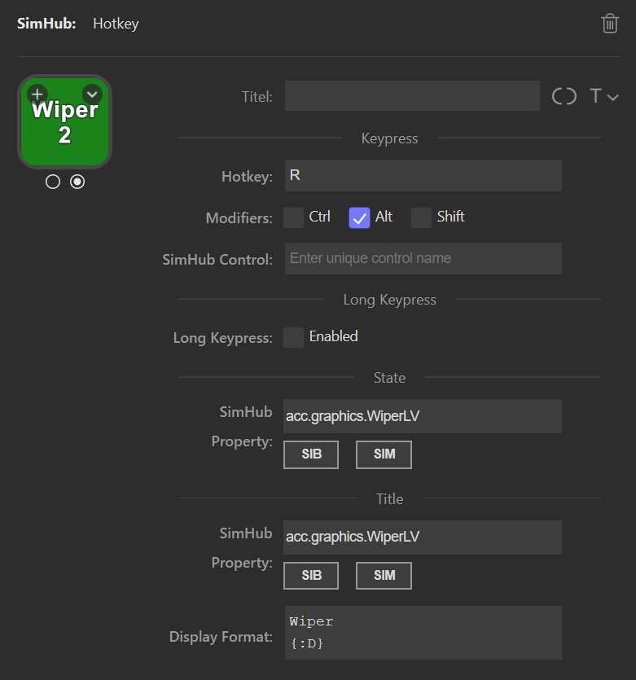

= Action "Hotkey"
:toc:
:sectnums:
ifdef::env-github[]
:tip-caption: :bulb:
endif::[]
ifndef::env-github[]
:tip-caption: 💡
endif::[]

TIP: Always read the *correct version* of the documentation, which matches the version of the plugin that you have installed. To do so, use the dropdown in the top left, which usually contains the value "main". Select the "tag" that matches your installed version.

== Description

This action offers the same functionality as the built-in action "Hotkey", but with some additional - mostly SimHub related - features. The features are as follows:

* Send a keystroke event to the active window (like the built-in "Hotkey")
* Send an input trigger to SimHub
* Assign SimHub control mapper roles to Stream Deck keys
* Allow different keystrokes for short and long button presses
* Bind the state of the button ("on" or "off") to the real state of a SimHub property
* Show the value of a SimHub property on the button

This allows to interact with the simulation (by sending keystroke events to the simulation), to interact with SimHub (by sending input triggers to SimHub) and to visualize the correct state of properties, no matter if these properties have been modified by the button or some other means: The button will always display the correct state.

The fields of this action are as follows:

Section Keypress::

* *Hotkey* +
  This optional field takes a key, which should be sent to the active window. +
  Please see the structure link:/StreamDeckSimHub.Plugin/Tools/Keyboard.cs[VirtualKeyShort] for supported key names. For alphanumeric keys (0-1, A-Z) the prefix `KEY_` can be omitted, so either `KEY_P` and `P` will have the same result. +
  Some examples of valid values for the field "Hotkey" are:
  ** `A` (will send the event for the key "A" to the active window)
  ** `KEY_A` (same as above)
  ** `SPACE` (will send an event for the space key)
  ** `F11` (event for F11)
+
Please note, that not all entries in "VirtualKeyShort" make sense in the field "Hotkey".

* *Modifiers* +
  Modifiers like Ctrl, Alt and Shift have to be specified by using the corresponding checkbox.
* *SimHub Control* +
  This optional field may take a *unique* string. This string will be sent as an input trigger to SimHub, where it is used to identify this Stream Deck button. See link:../inputtrigger/InputTrigger.adoc[InputTrigger.adoc] for details about input triggers.
* *SimHub (Control Mapper) Role* +
  SimHub allows the abstraction of input devices with its Control Mapper plugin. This dropdown field shows all available roles that have been defined in SimHub. Important: SimHub has to be running because the available roles are fetched online from SimHub.

Section Long Keypress::

* This section is basically the same as "Keypress", but it enables a special mode, in which a short press on a Stream Deck key triggers a different action than a long press. See the section <<#longKeypress>> for details.

Section State::

* *SimHub Property (for state)* +
  This optional field allows to enter the name of a SimHub property or even a logical expression with a SimHub property. The SimHub property or the result of the logical expression will be used to set the state of the button to either "on" or "off". See the section <<#simHubPropertyForState>> for details.

Section Title::

* *SimHub Property (for title)* +
  This optional field allows to specify a SimHub property, which will be displayed as the "Title" of the button. Be sure to leave the default Stream Deck field "Title" empty. However you can use all available formatting options of the default field "Title", like alignment, size, color etc.
* *Display Format (for title)* +
  Another optional field. If set, the SimHub property for the title will be formatted with this format string. If this field is empty, a default format is used. See the section <<#displayFormatForTitle>> for details.

[#longKeypress]
== Section "Long Keypress"

=== Description

If this section is enabled with the checkbox, the Stream Deck key will behave differently depending on whether it is pressed for a short or a longer period of time. This can be used if there are not enough keys available on the Stream Deck.

Note: SimHub has its own logic for short and long input triggers. The following only applies to key strokes. If only SimHub controls should be used for short and long, then the "Long Keypress" feature should be disabled.

=== Behavior if disabled

When this feature is *disabled*, the Stream Deck key behaves as follows: When the key is pressed, the plugin sends immediately the hotkey with its modifiers as a "KeyDown" event to Windows. When the Stream Deck key is released, the plugin sends a "KeyUp" event to Windows. This is the same behavior as holding down a key on the keyboard for a long time. For example, if the active window is an editor, the pressed key is repeated until it is released.

*Important:* The "KeyDown" event is sent immediately when the key is pressed.

=== Behavior if enabled

The plugin has to detect whether the Stream Deck key was pressed for a short or long time. Unfortunately, this only works if the key has been pressed for a certain time.

Therefore, the Stream Deck key now behaves as follows:

When the key is pressed, nothing happens at first. If the key is released again before "Long Time Span" milliseconds have elapsed, this is interpreted as a "short keystroke". The plugin sends a "KeyDown" event and "Short Hold Time" milliseconds later a "KeyUp" event to Windows. So for the application it looks like a key was pressed and hold for "Short Hold Time" milliseconds.

If "Long Time Span" milliseconds have elapsed and the key is still held down, this is interpreted as a "long keystroke". The plugin sends a "KeyDown" event to Windows and a "KeyUp" event, as soon as the key is released.

*Important:* The first "KeyDown" event is only sent, when either the Stream Deck key is released before "Long Time Span" or if "Long Time Span" milliseconds have elapsed. Thus the target application will not react immediately, when the key is pressed.

=== Parameters

* *Short Hold Time* +
How long will the "short" keypress be hold down. I.e. the time between the "KeyDown" event and the "KeyUp" event. Set to 50 ms by default. +
Should not be too short, otherwise some applications will have problems to detect that a key was pressed. If this is the case, the value can be increased to 100 ms.
* *Long Time Span* +
After how many milliseconds of holding down the Stream Deck key, it will be recognized as a "long" keypress. The target application will receive the "KeyDown" event for the long keystroke only after this many milliseconds. Set to 500 ms by default.

[#simHubPropertyForState]
== Field "SimHub Property (for state)"

This field allows to bind the button to a SimHub property, which will be used to determine the state of the button.

All properties, that are listed in SimHub under "Available properties" (around 2000+ properties) can be used. But the plugin allows access to even more properties, and for use in these Stream Deck actions, it is better to use "_typed_" properties instead of "_generic_" properties.

TIP: Be sure to read the documentation of the https://github.com/pre-martin/SimHubPropertyServer[SimHub Property Server plugin], especially the section about the available properties!

TIP: "Generic" properties are received untyped as `object` (see SimHubPropertyServer plugin). This plugin tries to interpret them as a `double` value. If this is not possible, they are treated as strings.

=== Simple SimHub Property

Enter the name of a SimHub property. E.g.

----
dcp.gd.EngineIgnitionOn
----

The value of this SimHub property will update the state of the button.

The logic for the action state depending on the SimHub property value is as follows:

* Properties of type `boolean`: +
  If the property value is `True`, the action will be in the "on" state, otherwise in the "off" state.
* Properties of type `integer`, `long`, `float` or `double`: +
  If the property value is greater than zero, the action will be in the "on" state, otherwise in the "off" state.

=== SimHub property with logical expression

This allows a much finer grained logic for the button state. Enter the name of a SimHub property, a condition and a value. E.g.

----
acc.graphics.gapBehind>=-500
----

In this example, the button would be in the state "on", if the gap behind is equal to or smaller than 500 milliseconds. It would be "off", if the gap behind is greater than 500 milliseconds. The field "Hotkey" could be empty in this example, so that the Stream Deck button could be used as an indicator only.

The following conditions are supported:

- `==` test for equal
- `>=`
- `>`
- `+<=+`
- `<`
- `!=` test for not equal
- `~~` test for "between two values", which means ">= value1 and +<=+ value2"

The condition "between" requires two values, which have to be separated by a semicolon, e.g.

----
acc.graphics.WiperLV~~1;2
----

The following table shows the comparison logic for different SimHub property types and comparison values (which are entered into the field "SimHub Property"):

|===
| SimHub property type | supported comparison values | evaluation rules

| boolean
| "true", "false"
| should be self explanatory

|
| any integer value
| comp. value == 0: "false" +
comp. value > 0: "true"

| integer
| any integer value
| should be self explanatory

|
| "true", "false"
| prop. value == 1: "true" +
all other prop. values: "false"

| long
| same as "integer"
| same as integer

| double
| any integer or floating
| should be self explanatory

| object
| anything
| The types of the property value and the comparision value have to be the same, otherwise they are treated as "not equal". The plugin tries to interpret property values of type "object" as "double". If this is possible, the comparison value should be also of type "double", otherwise they are "not equal".

|===

So the following expressions are all valid:

* SimHub property of type "boolean": +
  `dcp.gd.IsLapValid==true` or `dcp.gd.IsLapValid==1` or just `dcp.gd.IsLapValid`
* SimHub property of type "integer": +
  `dcp.gd.SpotterCarLeft>0` or `dcp.gd.SpotterCarLeft==true` or just `dcp.gd.SpotterCarLeft`
* Another "integer": +
  `acc.physics.Gear~2;4`
* Generic SimHub property: +
  `DataCorePlugin.GameData.SpotterCarLeft>0` or just `DataCorePlugin.GameData.SpotterCarLeft`

[#displayFormatForTitle]
== Field "Display Format (for title)"

If this field is empty, the value of the SimHub property for the title will be displayed with the default formatter of that type. If this is not desired, a more extensive format can be specified here.

Two options are available: A "*simple format*" and a "*full format*". The main difference is, that the "simple format" only allows an alignment and a format string, whereas the "full format" allows a combination of static text plus the features of the "simple format".

=== Simple Format

The display format has this syntax:

----
[alignment][:formatString]
----

If the format is invalid, the default formatter of the type is used as a fallback.

`alignment` is optional. It is a signed integer that indicates the total length of the title and whether it is right-aligned (a positive integer) or left-aligned (a negative integer)

`:formatString` is optional. It has to start with `:` (colon) and it has to be a valid C# format string.

Technically, the above syntax is the inner part of a C# format string. For details see:

* https://learn.microsoft.com/en-us/dotnet/api/system.string.format?view=net-6.0#the-format-item
* https://learn.microsoft.com/en-us/dotnet/standard/base-types/standard-numeric-format-strings
* https://learn.microsoft.com/en-us/dotnet/standard/base-types/custom-numeric-format-strings

Here are a few examples for the "Display Format" that should already cover a large number of cases. `_` is used in these examples to indicate a space in the generated output:

Only alignment::

* Display format `-3` will display the value left-aligned with a length of 3 digits:
** Property value `1` is displayed as `1__`
** Property value `34` is displayed as `34_`
** Property value `250` is displayed as `250`
* Display format `3` will display the value right-aligned with a length if 3 digits:
** Property value `1` is displayed as `__1`
** Property value `34` is displayed as `_34`
** Property value `250` is displayed as `250`

Only formatString::

* Display format `:F0` will display the value as a fixed-point value without decimal digits:
** `34.3333333` will be displayed as `34`
** `34.55` will be displayed as `35`
* Display format `:F1` will display the value as a fixed-point value with 1 decimal digit:
** `34.3333333` will be displayed as `34.3`
** `34.55` will be displayed as `34.6`

Both::

* Display format `3:F0` will display the value right-aligned with a length of 3 and without decimal digits:
** `34.3333333` will be displayed as `_34`
** `3.55` will be displayed as `__4`
* Display format `4:F1` will display the value right-aligned with a length of 4 and with 1 decimal digit:
** `3.55` will be displayed as `_3.6`
** `31.55` will be displayed as `31.6`

All characters are counted for the alignment - including decimal separator and decimal digits.

=== Full Format

The full format allows the same formatting features as the simple format, but the format can be combined with static text. The alignment and the format string have to be put into curly braces in order to be recognized. So a format in the full format may look like

----
Bias: {:F1}
----

Line breaks are also allowed, therefore a line break could be inserted in this example between `Bias:` and `{:F1}`, so that the entire content fits better on a button. In the same time, the colon can be omitted:

image::Example-Multiline-Title.png[Multiline Title]

== Buttons "SIB" and "SIM"

Everywhere, where a SimHub property can be used, there are also buttons labeled "SIB" and "SIM". These buttons are related to "ShakeIt Bass" and "ShakeIt Motors" properties from SimHub and are described in the separate document link:../shakeit/ShakeIt.adoc[ShakeIt.adoc]

== Examples

=== Button to toggle the Ignition in ACC

Mapped to "Shift + I" by default.

image::Example-Ignition.png[Ignition]

In this example, the ignition is turned on in the game, so the button is in the "on" state (determined via SimHub by the property `dcp.gd.EngineIgnitionOn`).

=== Button to toggle the Engine in ACC

;apped to "S" by default.

image::Example-Engine.png[Engine]

In this example, the engine is turned off in the game, so the button is in the "off" state (determined via SimHub by the property `dcp.gd.EngineStarted`).

=== Button without Hotkey functionality, but to display the brake bias:

image::Example-BrakeBias.png[Brake Bias]

The "generic" property `DataCorePlugin.GameData.BrakeBias` is uses as the title. Although the "typed" property `acc.physics.BrakeBias` would be better than the "generic" property, we cannot use the latter one, because ACC uses car-dependent offset values for the brake bias - SimHub, on the other hand, provides us with the corrected value.

=== Button with "short" for Ignition and "long" for Engine in ACC

image::Example-Ign-Eng.png[Ignition and Engine]

The same button can be used to toggle the ignition with a short press and the engine with a long press.

This can be used if there are not enough keys available on the Stream Deck.

=== Button to cycle through the Wiper stages in ACC

Mapped to "Alt + R" by default.

Just set a red icon for the "off" state and a green icon for the "on" state. Pressing this key cycles through the wiper stages "off" and 1 to 3 in ACC. The current stage is displayed on the Stream Deck key.

=== ACC Pit Limiter

Another useful button for ACC would be the Hotkey "Alt + L" with the SimHub property `gd.sdb.PitLimiterOn` to toggle the pit limiter.
