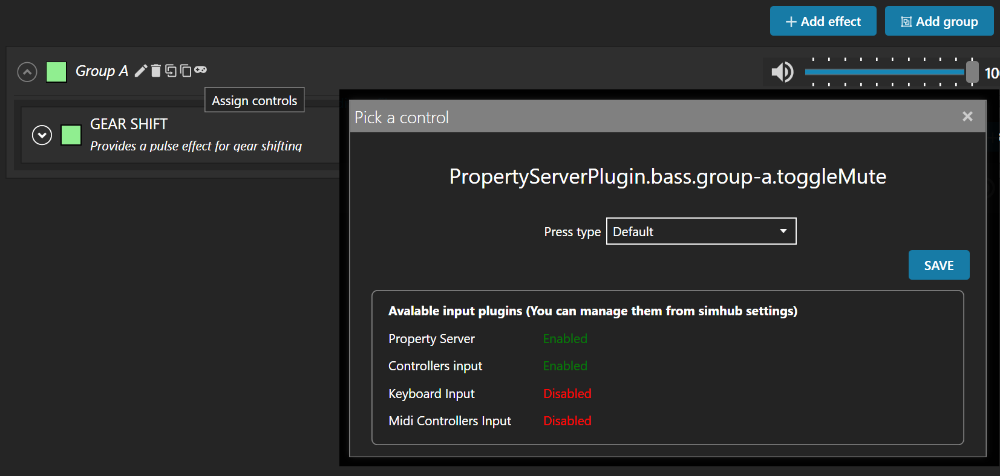

= Action "Input Trigger"
:toc:
:sectnums:
ifdef::env-github[]
:tip-caption: :bulb:
endif::[]
ifndef::env-github[]
:tip-caption: 💡
endif::[]

TIP: Always read the *correct version* of the documentation, which matches the version of the plugin that you have installed. To do so, use the dropdown in the top left, which usually contains the value "main". Select the "tag" that matches your installed version.

== Description

SimHub allows to trigger various actions by controller and/or keyboard inputs. For example:

* Controls can be mapped to actions in the menu "Control and events"
* Controls can be mapped to Bass Shaker effect groups and effects, in order to modify their gain value or to mute and unmute them.

The action "Input Trigger" extends the available inputs to the use of Stream Deck buttons. It has only one field:

* *SimHub Control* +
Simply enter a *unique* string into this field. This string will be used in SimHub to identify this Stream Deck button.

== Examples

In the following example, there is a "ShakeIt Bass" effect group. The Stream Deck button is used to mute or unmute this effect group. The configuration in Stream Deck will look as follows:

image::Example-TriggerInput-StreamDeck.png[Trigger Input]

In SimHub, the assignment dialog ("Pick a control") has to be opened. After pressing the Stream Deck button, the assignment will be shown as follows:

The Stream Deck button can now be used to mute and unmute the effect group in SimHub.

*Note*: This action is usually used inside of multi actions. For buttons with feedback, consider using the link:../Hotkey.adoc[Hotkey.adoc] action. It offers significantly more features, including the field "SimHub Control".

